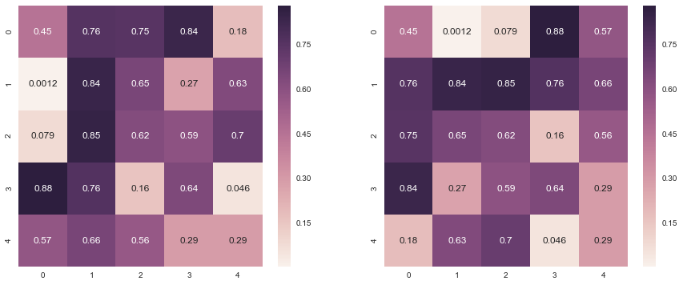

## Algebra: 


```python
import numpy as np
import seaborn as sns
import matplotlib.pyplot as plt
%matplotlib inline
sns.set()
```

#### 1. Dot Product

$$ u = M.v, C = A.B $$


```python
v = np.random.rand(5)
v
```


    array([ 0.61880652,  0.16277711,  0.77725885,  0.39357105,  0.72518988])


```python
M = np.random.rand(5,5)
M
```


    array([[ 0.44722927,  0.75871176,  0.74971577,  0.83610699,  0.18085266],
           [ 0.00121306,  0.84271476,  0.65241612,  0.27094445,  0.63364293],
           [ 0.07906587,  0.85301928,  0.62214839,  0.59205861,  0.70427723],
           [ 0.88162665,  0.76250728,  0.15724579,  0.63985535,  0.04617605],
           [ 0.57250482,  0.6551876 ,  0.562632  ,  0.29052545,  0.29159418]])


```python
u = np.dot(M,v)
u
```


    array([ 1.44319253,  1.21116885,  1.41510068,  1.07721068,  1.22403352])


```python
M = np.random.rand(5,5)
N = np.random.rand(5,5)
np.dot(M,N)
```


    array([[2.04187416, 1.27819139, 1.95077838, 1.61949482, 1.17248351],
           [1.7066333 , 0.83570007, 1.52109089, 1.39001526, 0.71187379],
           [1.44468595, 0.79383607, 1.35776556, 1.11653487, 0.79871042],
           [1.51494078, 1.10723018, 1.52666191, 1.23628874, 1.00665592],
           [0.51859666, 0.65862101, 0.61337647, 0.40747731, 0.66203929]])


#### 2. Kronecker Product


```python
I = np.eye(3)
O = np.ones((3,3))
I,O
```


    (array([[1., 0., 0.],
            [0., 1., 0.],
            [0., 0., 1.]]), array([[1., 1., 1.],
            [1., 1., 1.],
            [1., 1., 1.]]))


```python
KIO = np.kron(I,O)
KIO
```


    array([[1., 1., 1., 0., 0., 0., 0., 0., 0.],
           [1., 1., 1., 0., 0., 0., 0., 0., 0.],
           [1., 1., 1., 0., 0., 0., 0., 0., 0.],
           [0., 0., 0., 1., 1., 1., 0., 0., 0.],
           [0., 0., 0., 1., 1., 1., 0., 0., 0.],
           [0., 0., 0., 1., 1., 1., 0., 0., 0.],
           [0., 0., 0., 0., 0., 0., 1., 1., 1.],
           [0., 0., 0., 0., 0., 0., 1., 1., 1.],
           [0., 0., 0., 0., 0., 0., 1., 1., 1.]])


```python
KOI = np.kron(O,I)
KOI
```


    array([[1., 0., 0., 1., 0., 0., 1., 0., 0.],
           [0., 1., 0., 0., 1., 0., 0., 1., 0.],
           [0., 0., 1., 0., 0., 1., 0., 0., 1.],
           [1., 0., 0., 1., 0., 0., 1., 0., 0.],
           [0., 1., 0., 0., 1., 0., 0., 1., 0.],
           [0., 0., 1., 0., 0., 1., 0., 0., 1.],
           [1., 0., 0., 1., 0., 0., 1., 0., 0.],
           [0., 1., 0., 0., 1., 0., 0., 1., 0.],
           [0., 0., 1., 0., 0., 1., 0., 0., 1.]])


#### 3. Transpose of a matrix


```python
plt.figure(figsize = [15,6])
plt.subplot(1,2,1)
sns.heatmap(M, annot=True)
plt.subplot(1,2,2)
sns.heatmap(M.T, annot=True)
```


    <matplotlib.axes._subplots.AxesSubplot at 0x11ce902b0>





#### 4. Solve Matrix Equation : $$\large{Ax = b}$$

$$2x_1 + 3x_2 +5x_3 + 4x_4 +2x_5  = 19$$

$$5x_1 + 4x_2 +2x_3 + 6x_4 +1x_5  = 23$$

$$9x_1 + 2x_2 +4x_3 + 5x_4 +2x_5  = 45$$

$$1x_1 + 9x_2 +6x_3 + 9x_4 +3x_5  = 56$$

$49x_1 + 7x_2 +8x_3 + 4x_4 +x_5  = 12$$


```python
import numpy.linalg as LA
```


```python
A = np.array([[2,3,5,4,2],[5,4,2,6,1],[9,2,4,5,2],[1,9,6,9,3],[9,7,8,4,1]])
b = np.array([19,23,45,56,12])
x = LA.solve(A,b)
x
```


    array([  4.57281553,   9.84789644, -12.78964401,  -8.95145631,
            40.03236246])


```python
np.dot(A,x)
```


    array([19., 23., 45., 56., 12.])


#### 5. Inverse


```python
LA.det(A)
```


    -927.0000000000007


```python
AI = LA.inv(A)
AI
```


    array([[-0.21359223, -0.09708738,  0.17152104,  0.04854369,  0.03559871],
           [-0.57605178, -0.35275081,  0.18985976,  0.34304207,  0.09600863],
           [ 0.60517799,  0.27508091, -0.3193096 , -0.30420712,  0.06580367],
           [ 0.52427184,  0.60194175, -0.33009709, -0.30097087, -0.08737864],
           [-0.98381877, -1.26537217,  1.0021575 ,  0.79935275, -0.16936354]])


```python
np.dot(AI,A)
```


    array([[ 1.00000000e+00,  6.24500451e-17,  1.66533454e-16,
             1.66533454e-16,  6.93889390e-17],
           [-9.71445147e-17,  1.00000000e+00,  0.00000000e+00,
             3.33066907e-16,  1.80411242e-16],
           [ 4.57966998e-16, -2.91433544e-16,  1.00000000e+00,
            -2.22044605e-16, -1.52655666e-16],
           [-6.52256027e-16, -1.38777878e-17, -5.55111512e-16,
             1.00000000e+00, -2.08166817e-16],
           [ 5.82867088e-16, -5.82867088e-16,  2.22044605e-16,
             9.99200722e-16,  1.00000000e+00]])


#### 6. Singular Value Decomposition: Find Principle Axis


$$\large{A =PDQ}$$

$$X^{T}AX = 4x_1^2 + 6x_2^2 + 8x_3^2+ 8x_1x_2 + 6x_2x_3 - 16x_3x_1$$

$$ X^{T}AX = \begin{pmatrix} x_1 & x_2 & x_3 \end{pmatrix}\begin{pmatrix} 4 & 4 & -8 \\\ 
                  4 & 3 & 3 \\\
                 -8 &  3 & 4 \end{pmatrix}\begin{pmatrix} x_1 \\\ 
                  x_2 \\\
                  x_3 \end{pmatrix}$$

$$X^{T}AX = 12.06 x_1^2 + 6.56 x_2^2 + 5.5 x_3^2 $$


```python
A  = np.array([[4,4,-8],[4,3,3],[-8,3,4]])
```


```python
P,D,Q = LA.svd(A)
```


```python
D
```


    array([12.06630095,  6.56787841,  5.50157746])


```python
P
```


    array([[-0.72405638,  0.63996989,  0.25725649],
           [-0.09331565, -0.46043612,  0.88277447],
           [ 0.68339926,  0.61517243,  0.39310092]])


```python
Q
```


    array([[-0.72405638, -0.09331565,  0.68339926],
           [-0.63996989,  0.46043612, -0.61517243],
           [ 0.25725649,  0.88277447,  0.39310092]])


```python
LA.inv(P)
```


    array([[-0.72405638, -0.09331565,  0.68339926],
           [ 0.63996989, -0.46043612,  0.61517243],
           [ 0.25725649,  0.88277447,  0.39310092]])


```python
AN = np.matmul(np.matmul(P, np.diag(D)), Q)
AN
```


    array([[ 4.,  4., -8.],
           [ 4.,  3.,  3.],
           [-8.,  3.,  4.]])


```python
A
```


    array([[ 4,  4, -8],
           [ 4,  3,  3],
           [-8,  3,  4]])


```python
LA.det(P),LA.det(Q)
```


    (1.0000000000000004, -1.0000000000000002)


