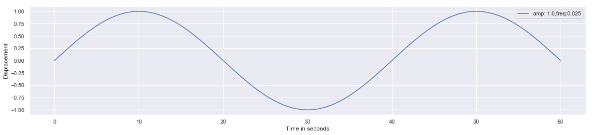
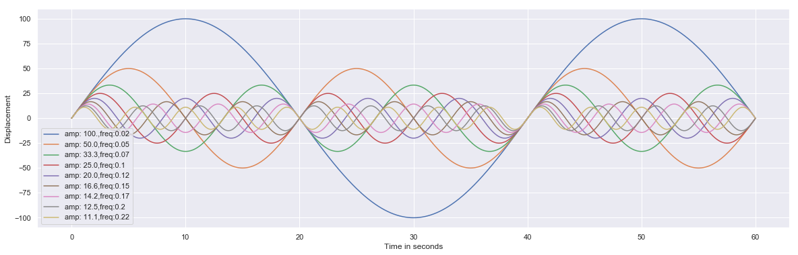
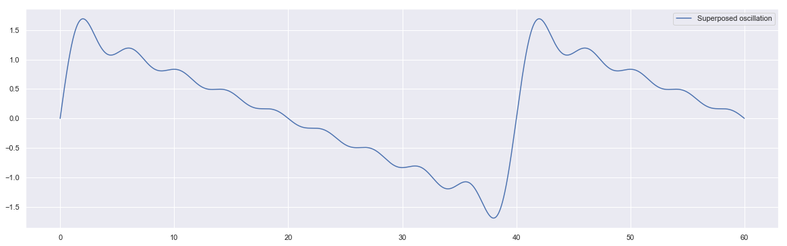

## Oscialltion


```python
import numpy as np
import matplotlib.pyplot as plt
import seaborn as sns
sns.set()
```

$$ Y = Asin(\omega t + \phi )$$


```python
fs = 100
ts = np.arange(0,60,1/fs)
ts
```


    array([0.000e+00, 1.000e-02, 2.000e-02, ..., 5.997e+01, 5.998e+01,
           5.999e+01])


```python
np.sin(ts)
```


    array([ 0.        ,  0.00999983,  0.01999867, ..., -0.27610536,
           -0.28570267, -0.29527141])


```python
freq = 0.5
ts*(2*np.pi*freq)
```


    array([0.00000000e+00, 3.14159265e-02, 6.28318531e-02, ...,
           1.88401311e+02, 1.88432727e+02, 1.88464143e+02])


### Single oscillation


```python
fs = 100
ts = np.arange(0,60,1/fs)
amp = 1.0
freq = 0.025

'''initialize figure'''
plt.figure(figsize = [20,4])

'''create oscillation:  Y = Asin(wt)| w = 2.pi.f'''
ys = amp*np.sin(ts*(2*np.pi*freq))

lb = "amp: " + str(amp) + ",freq:" + str(freq)   
plt.plot(ts,ys, label = lb)
    
plt.xlabel("Time in seconds") 
plt.ylabel("Displacement")
plt.legend()
plt.show()
```





### Variable Amplitude and Frequency in Oscillation


```python
fs = 100
ts = np.arange(0,60,1/fs)
'''initialize figure'''
plt.figure(figsize = [20,6])

'''iterate over each amplitude and 
frequency and create a oscillation plot'''

for i in range(1,10):
    amp = 100*1/float(i)
    freq = 0.025*i
    
    '''Y= A sin(wt) | w = 2*pi*f'''
    ys = amp*np.sin(ts*2*np.pi*freq)
    
    lb= "amp: "+str(amp)[0:4] + ",freq:"+str(freq)[0:4]
    plt.plot(ts,ys,label=lb )
    
plt.xlabel("Time in seconds") 
plt.ylabel("Displacement")
plt.legend()
plt.show()
```





### Superposition of oscillations


```python
fs = 100
ts = np.arange(0,60,1/fs)

'''initialize figure'''
plt.figure(figsize = [20,6])

'''define 10 different amplitudes and frequencies'''
amps = [1*1/float(i) for i in range(1,10)]
freqs = [0.025*i for i in range(1,10)]

'''List comprehension: '''
ys = sum([amp*np.sin(ts*2*np.pi*freq) for amp,freq in zip(amps,freqs)])

'''create a plot'''
plt.plot(ts,ys, label= "Superposed oscillation")
plt.legend()
plt.show()
```





Is this a sawtooth wave?

-----------

### Assignment:
1. Write python function for creating a random oscialltion with amplitude in range (1,5) and frequency in range (0.25,1)
2. Create 20 different oscillations by implementing python function defined above and implement superposition principle to obtain single resultant oscillation.


```python
def oscillator():
    '''implement y = Asin(wt)+Bcos(wt) with random
    amplitude in (1,5) and freq in (0.25,1)'''
    
    
    
```


