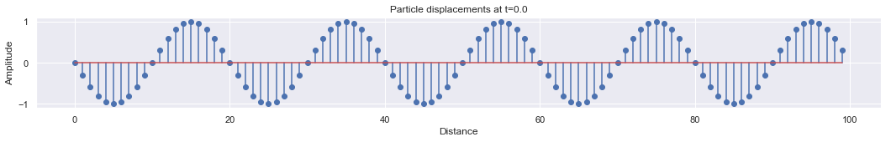
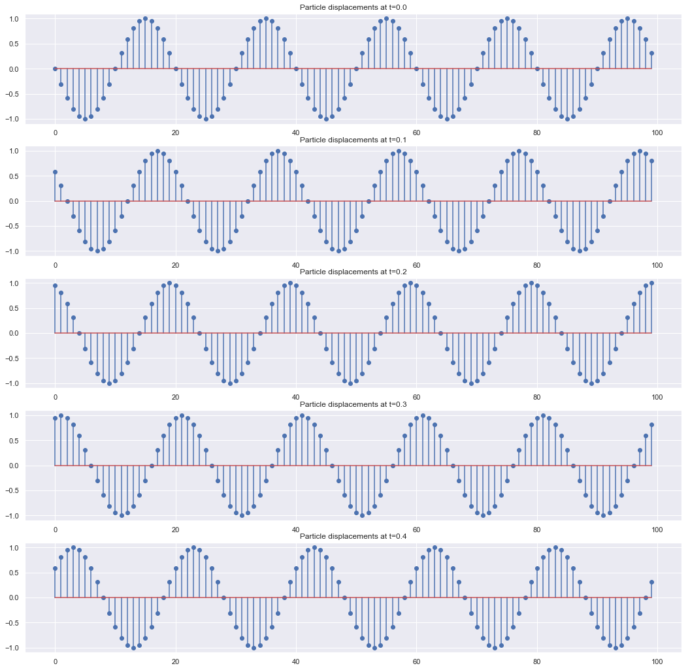
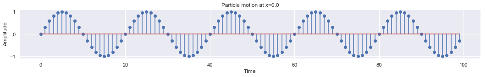
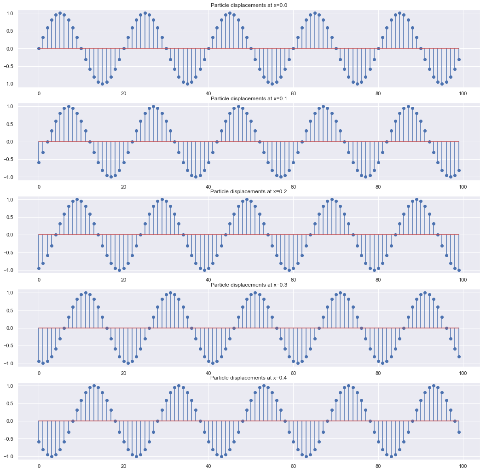

## Wave Propagation


A wave function is defined as 

$$Y = A \sin(\omega t + kx)$$

Differential equation

$$\large{\frac{\partial^{2}U}{dt^{2}} = c^{2}\frac{\partial^{2}U}{dx^{2}}}$$


```python
import numpy as np
import matplotlib.pyplot as plt
import seaborn as sns 
sns.set()
```

- Define Amplitude, angular frequency, wave vector


```python
amp = 1.0
freq = 1
w = 2*np.pi*freq #angular frequency
k = 2*np.pi #wave vector
```

- Calcualte frequency, weblength and velocity


```python
wave_length = 2*np.pi/k
velocity = freq*wave_length
(freq,wave_length,velocity)
```


    (1, 1.0, 1.0)


### Plot the different configuration of wave motion


```python
xs = np.arange(0,5,1/20)
ts = np.arange(0,5,1/20)
```


```python
len(xs),len(ts)
```


    (100, 100)


### 1. Experiment: Plot the particle displacement keeping time fixed
When we fix the time, it is a photograph of the wave motion at specific time t0. It can be represent as

$$Y = A \sin (kx + \phi_{0})$$

A special case is **closed vibrating string**


```python
plt.figure(figsize = [18,2])
t0 = 0.0
y = amp*np.sin(w*t0 - k*xs)
plt.stem(y)
plt.xlabel("Distance")
plt.ylabel("Amplitude")
plt.title('Particle displacements at t=' + str(t0))
```


    Text(0.5, 1.0, 'Particle displacements at t=0.0')





```python
plt.figure(figsize = [18,18])
t0s = [0.0,0.1,0.2,0.3,0.4]
for i,t0 in enumerate(t0s):
    plt.subplot(len(t0s),1,i+1)
    y = amp*np.sin(w*t0 - k*xs)
    plt.stem(y)
    plt.title('Particle displacements at t=' + str(t0))

plt.show()
```





### 2. Experiment: Plot the particle displacement keeping position fixed

When we fix the position and look at a single particle displacement, it behaves like a harmonic oscillator. It can be represent as

$$Y = A \sin (\omega t + \phi_{0})$$

A special case is **harmonic oscillator**


```python
plt.figure(figsize = [18,2])
x0 = 0.0
y = amp*np.sin(w*ts - k*x0)
plt.stem(y)
plt.xlabel("Time")
plt.ylabel("Amplitude")
plt.title("Particle motion at x=" + str(x0))
```


    Text(0.5, 1.0, 'Particle motion at x=0.0')





```python
plt.figure(figsize = [18,18])
x0s = [0.0,0.1,0.2,0.3,0.4]
for i,x0 in enumerate(t0s):
    plt.subplot(len(x0s),1,i+1)
    y = amp*np.sin(w*ts - k*x0)
    plt.stem(y)
    plt.title('Particle displacements at x=' + str(x0))

plt.show()
```





-----------------

### Animation 1D

Wave propagation in 1D


### Next Step: 
Wave Propagation in 2D (```numpy meshgrid```)

 </img>

