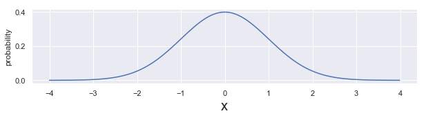
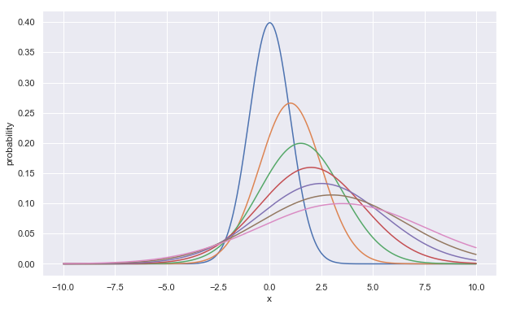
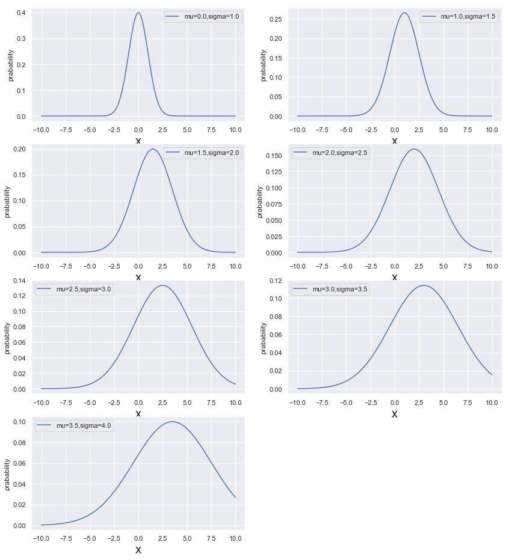

## Arange : ```arange```


```python
import numpy as np
```


```python
X = np.arange(10)
X
```


    array([0, 1, 2, 3, 4, 5, 6, 7, 8, 9])


```python
X-1.0
```


    array([-1.,  0.,  1.,  2.,  3.,  4.,  5.,  6.,  7.,  8.])


```python
10+X
```


    array([10, 11, 12, 13, 14, 15, 16, 17, 18, 19])


```python
np.arange(3,12)
```


    array([ 3,  4,  5,  6,  7,  8,  9, 10, 11])


```python
np.arange(1,10,2)
```


    array([1, 3, 5, 7, 9])


```python
np.arange(10,11,0.01)
```


    array([10.  , 10.01, 10.02, 10.03, 10.04, 10.05, 10.06, 10.07, 10.08,
           10.09, 10.1 , 10.11, 10.12, 10.13, 10.14, 10.15, 10.16, 10.17,
           10.18, 10.19, 10.2 , 10.21, 10.22, 10.23, 10.24, 10.25, 10.26,
           10.27, 10.28, 10.29, 10.3 , 10.31, 10.32, 10.33, 10.34, 10.35,
           10.36, 10.37, 10.38, 10.39, 10.4 , 10.41, 10.42, 10.43, 10.44,
           10.45, 10.46, 10.47, 10.48, 10.49, 10.5 , 10.51, 10.52, 10.53,
           10.54, 10.55, 10.56, 10.57, 10.58, 10.59, 10.6 , 10.61, 10.62,
           10.63, 10.64, 10.65, 10.66, 10.67, 10.68, 10.69, 10.7 , 10.71,
           10.72, 10.73, 10.74, 10.75, 10.76, 10.77, 10.78, 10.79, 10.8 ,
           10.81, 10.82, 10.83, 10.84, 10.85, 10.86, 10.87, 10.88, 10.89,
           10.9 , 10.91, 10.92, 10.93, 10.94, 10.95, 10.96, 10.97, 10.98,
           10.99])


#### Application : Plot multi-functions


```python
import matplotlib.pyplot as plt
import seaborn as sns
%matplotlib inline
sns.set()
```

#### Gaussian Distribution


```python
len(np.arange(-4,4,0.01))
```


    800


```python
xs = np.arange(-4,4,0.01)

plt.figure(figsize = [10,2])

sigma =1.0
mu = 0.0

N = 1/np.sqrt(2*np.pi*sigma**2)
fx = N*np.exp(-(xs-mu)**2/(2*sigma**2))

plt.plot(xs,fx)
plt.xlabel('x',fontsize =20)
plt.ylabel('probability')
plt.show()
```





```python
xs = np.arange(-10,10,0.01)
plt.figure(figsize = [10,6])

sigmas = [ 1.0,1.5,2.0,2.5,3.0,3.5,4.0]
mus = [0.0,1.0,1.5,2.0,2.5,3.0,3.5]

for s,m in zip(sigmas,mus):
    
    N = 1/np.sqrt(2*np.pi*s**2)
    fx = N*np.exp(-(xs-m)**2/(2*s**2))
    plt.plot(xs,fx, label = "mu="+str(m)+",sigma="+str(s))
    
plt.xlabel('x')
plt.ylabel('probability')
plt.show()
```





```python
xs = np.arange(-10,10,0.01)
plt.figure(figsize = [14,16])

sigmas = [ 1.0,1.5,2.0,2.5,3.0,3.5,4.0]
mus = [0.0,1.0,1.5,2.0,2.5,3.0,3.5]

k = 1
for s,m in zip(sigmas,mus):
    plt.subplot(4,2,k)
    N = 1/np.sqrt(2*np.pi*s**2)
    fx = N*np.exp(-(xs-m)**2/(2*s**2))
    
    plt.plot(xs,fx, label = "mu="+str(m)+",sigma="+str(s))
    plt.xlabel('x',fontsize =20)
    plt.ylabel('prabability')
    plt.legend()
    k = k+1
plt.show()
```





#### List Comprehension with ```arange```


```python
xs = np.arange(0,3.14,0.1)
np.sin(xs)
```


    array([0.        , 0.09983342, 0.19866933, 0.29552021, 0.38941834,
           0.47942554, 0.56464247, 0.64421769, 0.71735609, 0.78332691,
           0.84147098, 0.89120736, 0.93203909, 0.96355819, 0.98544973,
           0.99749499, 0.9995736 , 0.99166481, 0.97384763, 0.94630009,
           0.90929743, 0.86320937, 0.8084964 , 0.74570521, 0.67546318,
           0.59847214, 0.51550137, 0.42737988, 0.33498815, 0.23924933,
           0.14112001, 0.04158066])


```python
np.cos(xs)
```


    array([ 1.        ,  0.99500417,  0.98006658,  0.95533649,  0.92106099,
            0.87758256,  0.82533561,  0.76484219,  0.69670671,  0.62160997,
            0.54030231,  0.45359612,  0.36235775,  0.26749883,  0.16996714,
            0.0707372 , -0.02919952, -0.12884449, -0.22720209, -0.32328957,
           -0.41614684, -0.5048461 , -0.58850112, -0.66627602, -0.73739372,
           -0.80114362, -0.85688875, -0.90407214, -0.94222234, -0.97095817,
           -0.9899925 , -0.99913515])


**Sum of sin(x)+cos(x)**


```python
np.sin(xs)+ np.cos(xs)
```


    array([ 1.        ,  1.09483758,  1.17873591,  1.2508567 ,  1.31047934,
            1.3570081 ,  1.38997809,  1.40905987,  1.4140628 ,  1.40493688,
            1.38177329,  1.34480348,  1.29439684,  1.23105701,  1.15541687,
            1.06823219,  0.97037408,  0.86282032,  0.74664554,  0.62301052,
            0.49315059,  0.35836326,  0.21999529,  0.07942919, -0.06193053,
           -0.20267147, -0.34138738, -0.47669226, -0.60723419, -0.73170884,
           -0.84887249, -0.95755449])


**List including array for cos(x), cos(2x), cos(3x), cos(4x)**


```python
[np.cos(n*xs) for n in range(1,5)]
```


    [array([ 1.        ,  0.99500417,  0.98006658,  0.95533649,  0.92106099,
             0.87758256,  0.82533561,  0.76484219,  0.69670671,  0.62160997,
             0.54030231,  0.45359612,  0.36235775,  0.26749883,  0.16996714,
             0.0707372 , -0.02919952, -0.12884449, -0.22720209, -0.32328957,
            -0.41614684, -0.5048461 , -0.58850112, -0.66627602, -0.73739372,
            -0.80114362, -0.85688875, -0.90407214, -0.94222234, -0.97095817,
            -0.9899925 , -0.99913515]),
     array([ 1.        ,  0.98006658,  0.92106099,  0.82533561,  0.69670671,
             0.54030231,  0.36235775,  0.16996714, -0.02919952, -0.22720209,
            -0.41614684, -0.58850112, -0.73739372, -0.85688875, -0.94222234,
            -0.9899925 , -0.99829478, -0.96679819, -0.89675842, -0.79096771,
            -0.65364362, -0.49026082, -0.30733287, -0.11215253,  0.08749898,
             0.28366219,  0.46851667,  0.63469288,  0.77556588,  0.88551952,
             0.96017029,  0.9965421 ]),
     array([ 1.        ,  0.95533649,  0.82533561,  0.62160997,  0.36235775,
             0.0707372 , -0.22720209, -0.5048461 , -0.73739372, -0.90407214,
            -0.9899925 , -0.98747977, -0.89675842, -0.7259323 , -0.49026082,
            -0.2107958 ,  0.08749898,  0.37797774,  0.63469288,  0.83471278,
             0.96017029,  0.99985864,  0.95023259,  0.8157251 ,  0.60835131,
             0.34663532,  0.05395542, -0.24354415, -0.51928865, -0.74864665,
            -0.91113026, -0.99222533]),
     array([ 1.        ,  0.92106099,  0.69670671,  0.36235775, -0.02919952,
            -0.41614684, -0.73739372, -0.94222234, -0.99829478, -0.89675842,
            -0.65364362, -0.30733287,  0.08749898,  0.46851667,  0.77556588,
             0.96017029,  0.99318492,  0.86939749,  0.60835131,  0.25125984,
            -0.14550003, -0.51928865, -0.81109301, -0.97484362, -0.98468786,
            -0.83907153, -0.56098426, -0.19432991,  0.20300486,  0.56828963,
             0.84385396,  0.9861923 ])]


**Sum of cos(x)+cos(2x)+cos(3x)+cos(4x)**


```python
sum([np.cos(n*xs) for n in range(1,5)])
```


    array([ 4.        ,  3.85146823,  3.4231699 ,  2.76463983,  1.95092594,
            1.07247523,  0.22309756, -0.51225912, -1.0681813 , -1.40642268,
           -1.51948065, -1.42971764, -1.18429539, -0.84680556, -0.48695014,
           -0.16988081,  0.0531896 ,  0.15173255,  0.11908368, -0.02828465,
           -0.2551202 , -0.51453694, -0.75669441, -0.93754707, -1.02623127,
           -1.00991764, -0.89540092, -0.70725333, -0.48294025, -0.26579566,
           -0.09709851, -0.00862608])


```python

```


```python

```
