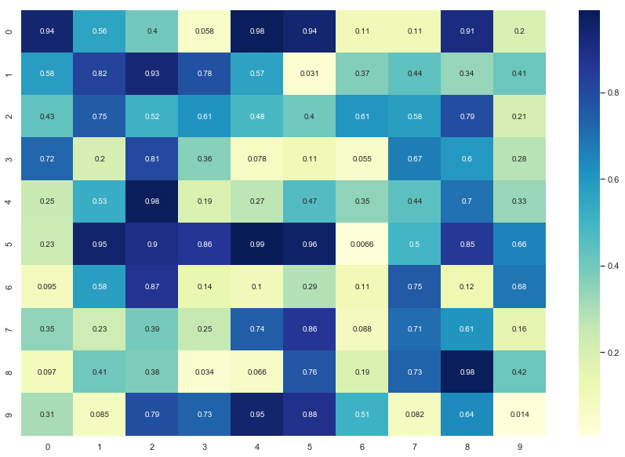
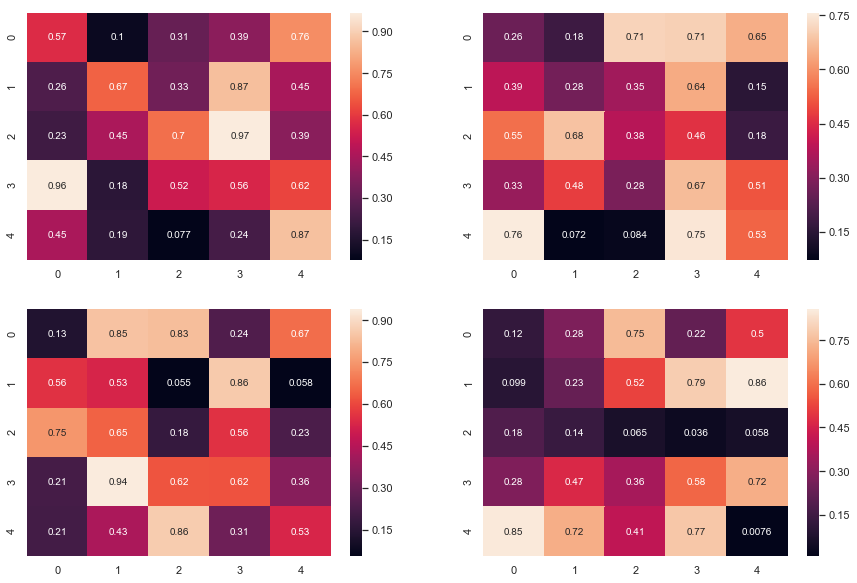

## Array : 
```numpy.array``` ,   ```numpy.array.shape```,   ```numpy.reshape```, ```numpy.concatenate```


```python
import numpy as np
```


```python
L = [1,3,5,7,"apple",2.4]
L
```


    [1, 3, 5, 7, 'apple', 2.4]


```python
L[4]
```


    'apple'


```python
L + L
```


    [1, 3, 5, 7, 1, 3, 5, 7]


```python
A = np.array([1,2,3,4])
```


    array([1, 2, 3, 4])


```python
A = np.array([[2,3,5],[3,5,7],[6,8,9]])
```


```python
np.zeros([3,4])
```


    array([[0., 0., 0., 0.],
           [0., 0., 0., 0.],
           [0., 0., 0., 0.]])


```python
np.ones([3,3])
```


    array([[1., 1., 1.],
           [1., 1., 1.],
           [1., 1., 1.]])


```python
X = np.random.rand(5,5)
X
```


    array([[0.24328245, 0.97738463, 0.18213799, 0.83052358, 0.3653109 ],
           [0.63924704, 0.32634262, 0.93738712, 0.04190707, 0.16856443],
           [0.02439421, 0.64339841, 0.25104598, 0.07552312, 0.33859142],
           [0.24346396, 0.09796353, 0.3732192 , 0.2614549 , 0.13293965],
           [0.13669362, 0.3105436 , 0.51570164, 0.04806873, 0.88910613]])


```python
X = np.array([[1,3,4],[2,4,7],[3,7,9]])
X
```


    array([[1, 3, 4],
           [2, 4, 7],
           [3, 7, 9]])


```python
LL = [[1,3,4],[2,4,7],[3,7,9]]
LL[1][2]
```


    7


```python
X[1,2]
```


    7


### Array Indexing


```python
X = np.random.rand(5,5)
X
```


    array([[0.53015554, 0.34082372, 0.17875984, 0.64703264, 0.2235947 ],
           [0.34290729, 0.66984187, 0.40666649, 0.82657358, 0.66325498],
           [0.22065645, 0.93000416, 0.57442424, 0.70437704, 0.55194144],
           [0.06551909, 0.43306581, 0.40549847, 0.31129663, 0.99645275],
           [0.26043963, 0.73481174, 0.05637365, 0.2926374 , 0.82444519]])


```python
X[1]
```


    array([0.34290729, 0.66984187, 0.40666649, 0.82657358, 0.66325498])


```python
X[2,3]
```


    0.7043770359239762


```python
X[2:]
```


    array([[0.22065645, 0.93000416, 0.57442424, 0.70437704, 0.55194144],
           [0.06551909, 0.43306581, 0.40549847, 0.31129663, 0.99645275],
           [0.26043963, 0.73481174, 0.05637365, 0.2926374 , 0.82444519]])


```python
X[:,1]
```


    array([0.34082372, 0.66984187, 0.93000416, 0.43306581, 0.73481174])


```python
X[:,3]
```


    array([0.64703264, 0.82657358, 0.70437704, 0.31129663, 0.2926374 ])


```python
X[1:3,2:4]
```


    array([[0.55330373, 0.06741463],
           [0.97854604, 0.18927008]])


```python
for i in range(5):
    for j in range(5):
        if i== j:
            print(X[i,j])
```

    0.530155537186793
    0.6698418707020536
    0.5744242448498665
    0.31129663385625317
    0.8244451854101277


```python
np.diag(X)
```


    array([0.53015554, 0.66984187, 0.57442424, 0.31129663, 0.82444519])


### Visualization of an array


```python
import matplotlib.pyplot as plt
import seaborn as sns
sns.set()
```


```python
X = np.random.rand(10,10)
```


```python
plt.figure(figsize = [15,10])
sns.heatmap(X, annot=True,cmap="YlGnBu")
```


    <matplotlib.axes._subplots.AxesSubplot at 0x1a174a4240>





#### Subarray : 
Splitting to 4 subarrays


```python
plt.figure(figsize = [15,10])

plt.subplot(2,2,1)
sns.heatmap(X[0:5,0:5], annot=True)

plt.subplot(2,2,2)
sns.heatmap(X[5:10,0:5], annot=True)

plt.subplot(2,2,3)
sns.heatmap(X[0:5,5:10], annot=True)

plt.subplot(2,2,4)
sns.heatmap(X[5:10,5:10], annot=True)

plt.show()
```





### Shape:
Change shape of array:  from [10 by 10] to [20 by 5]

* Find Array shape


```python
X.shape
```


    (10, 10)


* Modify shape


```python
X.shape = (20,5)
X
```


    array([[0.93852928, 0.5629153 , 0.40031156, 0.05806378, 0.97983286],
           [0.94297538, 0.10800161, 0.11069516, 0.90720548, 0.19857628],
           [0.58431666, 0.82412861, 0.92679995, 0.77921264, 0.5673404 ],
           [0.03117379, 0.36952646, 0.44022574, 0.33607312, 0.4144617 ],
           [0.43455739, 0.74942589, 0.51639448, 0.61336095, 0.48473164],
           [0.40440422, 0.60614083, 0.57705755, 0.79288636, 0.21180724],
           [0.72241987, 0.19907833, 0.80578831, 0.36106624, 0.0778791 ],
           [0.11341762, 0.05541729, 0.67124287, 0.59567082, 0.27976907],
           [0.24750836, 0.52605463, 0.97923593, 0.1903222 , 0.26829744],
           [0.46525502, 0.34985357, 0.44309043, 0.69688965, 0.33400436],
           [0.23468938, 0.94940977, 0.89626526, 0.86187936, 0.99052044],
           [0.96050669, 0.0065963 , 0.49770304, 0.85285478, 0.65581363],
           [0.09482151, 0.57702584, 0.86883705, 0.14260322, 0.10167723],
           [0.2856549 , 0.11293518, 0.75423858, 0.12482127, 0.68321163],
           [0.34892935, 0.23105718, 0.39435598, 0.2528592 , 0.74207706],
           [0.8628569 , 0.08761234, 0.70950303, 0.60906093, 0.15525657],
           [0.09659796, 0.40521082, 0.3779406 , 0.03447772, 0.06621547],
           [0.76406415, 0.18869095, 0.73287798, 0.98307838, 0.41521145],
           [0.30999207, 0.0850545 , 0.79054693, 0.72950549, 0.94548169],
           [0.88379333, 0.51067006, 0.08175909, 0.63589428, 0.01402678]])


### Reshaping the Array


```python
X = np.arange(35)
X
```


    array([ 0,  1,  2,  3,  4,  5,  6,  7,  8,  9, 10, 11, 12, 13, 14, 15, 16,
           17, 18, 19, 20, 21, 22, 23, 24, 25, 26, 27, 28, 29, 30, 31, 32, 33,
           34])


```python
XX = np.reshape(X, (7, 5))
```


```python
XX
```


    array([[ 0,  1,  2,  3,  4],
           [ 5,  6,  7,  8,  9],
           [10, 11, 12, 13, 14],
           [15, 16, 17, 18, 19],
           [20, 21, 22, 23, 24],
           [25, 26, 27, 28, 29],
           [30, 31, 32, 33, 34]])


```python
X = np.arange(35).reshape(7,5)
X
```


    array([[ 0,  1,  2,  3,  4],
           [ 5,  6,  7,  8,  9],
           [10, 11, 12, 13, 14],
           [15, 16, 17, 18, 19],
           [20, 21, 22, 23, 24],
           [25, 26, 27, 28, 29],
           [30, 31, 32, 33, 34]])


### Flatten the Array


```python
X = np.random.rand(4,5)
X.shape
```


    (4, 5)


```python
X
```


    array([[0.46425663, 0.26273357, 0.76715497, 0.02803551, 0.06077554],
           [0.45085724, 0.20021709, 0.83866571, 0.93010498, 0.82287586],
           [0.64015274, 0.40214994, 0.46140888, 0.10875569, 0.90314464],
           [0.1996534 , 0.00575243, 0.19888495, 0.80968552, 0.66819322]])


```python
type(X)
```


    numpy.ndarray


```python
Y = X.flatten()
Y.shape
```


    (20,)


```python
Y
```


    array([0.46425663, 0.26273357, 0.76715497, 0.02803551, 0.06077554,
           0.45085724, 0.20021709, 0.83866571, 0.93010498, 0.82287586,
           0.64015274, 0.40214994, 0.46140888, 0.10875569, 0.90314464,
           0.1996534 , 0.00575243, 0.19888495, 0.80968552, 0.66819322])


### Concatenate the Array


```python
A = np.random.rand(3,4)
B = np.random.rand(3,4)
```

#### Verticle addition


```python
C = np.concatenate((A,B),axis =0)
```


```python
C
```


    array([[0.72279121, 0.69991245, 0.02998703, 0.12220733],
           [0.0016784 , 0.57873713, 0.43938855, 0.20021548],
           [0.18972308, 0.44890851, 0.76709578, 0.73554246],
           [0.89593371, 0.48033999, 0.45776717, 0.65204457],
           [0.53473347, 0.76373758, 0.67908483, 0.74560973],
           [0.32444887, 0.838872  , 0.72398484, 0.81445926]])


#### Horizontal Addition


```python
D = np.concatenate((A,B),axis =1)
```


```python
D
```


    array([[0.72279121, 0.69991245, 0.02998703, 0.12220733, 0.89593371,
            0.48033999, 0.45776717, 0.65204457],
           [0.0016784 , 0.57873713, 0.43938855, 0.20021548, 0.53473347,
            0.76373758, 0.67908483, 0.74560973],
           [0.18972308, 0.44890851, 0.76709578, 0.73554246, 0.32444887,
            0.838872  , 0.72398484, 0.81445926]])


### Row sum and column sum


```python
X = np.random.rand(8,6)
```

##### sum of all elements


```python
X.sum()
```


    24.566949569026413


#### Row sum


```python
np.sum(X,axis =1)
```


    array([4.20288936, 2.3996539 , 2.46388761, 4.30291271, 2.60671914,
           2.23461285, 2.68832592, 3.6679481 ])


#### Column sum


```python
np.sum(X,axis =0)
```


    array([3.69453055, 3.84555591, 5.87500707, 2.90605569, 4.41441644,
           3.83138392])


