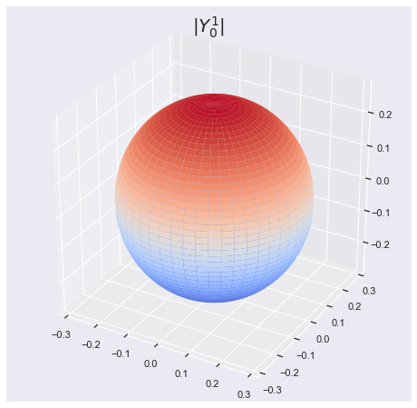
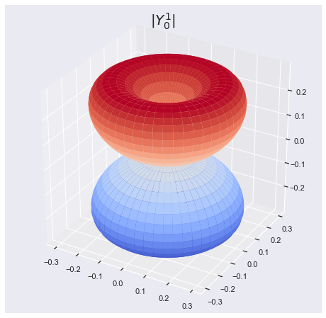
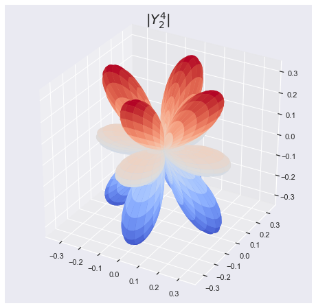
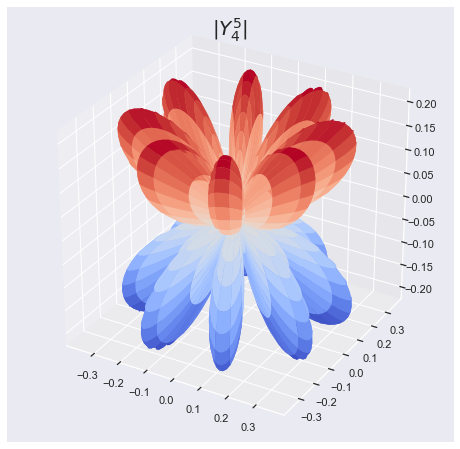

## Meshgrid : Spherical Harmonics


```python
import numpy as np
import matplotlib.pyplot as plt
import seaborn as sns
sns.set()
```

#### Example : Spherical Harmonics

$$Y(\theta,\phi) : \langle \theta,\phi|l,m \rangle $$


|value of l|value of m|Spherical Harmonics in position space|
|--|--|--|
|l=0|m=0| $$ Y_0^0(\theta,\phi)=\frac{1}{2}\sqrt{\frac{1}{\pi}}$$|
|l=1|m=-1|$$ Y_1^{-1}(\theta, \phi) = \frac{1}{2} \sqrt{\frac{3}{2\pi}} e^{-i\theta} \sin(\phi) $$|                
|l=1|m=0|$$ Y_1^0(\theta, \phi) = \frac{1}{2} \sqrt{\frac{3}{\pi}} \cos(\phi) $$|
|l=1|m=1|$$ Y_1^1(\theta, \phi) = -\frac{1}{2} \sqrt{\frac{3}{2\pi}} e^{i\theta} \sin(\phi) $$|


```python
import scipy.special as sp
from matplotlib import cm
from mpl_toolkits.mplot3d import Axes3D
```


```python
phis,thetas = np.mgrid[0:2*np.pi:200j, 0:np.pi:100j] 
```

####  Example 1 : $$Y_0^0(\theta, \phi) = \frac{1}{2} \sqrt{\frac{1}{\pi}}$$


```python
l = 0
m = 0   

RG = np.abs(sp.sph_harm(m,l,phis,thetas)) 

'''spherical to cartesian'''
XG = RG * np.sin(thetas) * np.cos(phis)
YG = RG * np.sin(thetas) * np.sin(phis)
ZG = RG * np.cos(thetas)

'''normalization with maximum value'''
NG = RG/RG.max()

'''plot figure'''
fig = plt.figure(figsize = [8,8])
ax = fig.gca(projection='3d')

surf = ax.plot_surface(XG, YG, ZG,\
                       cmap=cm.coolwarm,\
                       linewidth=0)

plt.title(r'$|Y^1_ 0|$', fontsize=20)
plt.show()
```





####  Example 2: $$ Y_2^1(\theta, \phi)$$


```python
l = 2
m = 1 

RG = np.abs(sp.sph_harm(m,l,phis,thetas)) 

'''spherical to cartesian'''
XG = RG * np.sin(thetas) * np.cos(phis)
YG = RG * np.sin(thetas) * np.sin(phis)
ZG = RG * np.cos(thetas)

'''normalization with maximum value'''
NG = RG/RG.max()

'''plot figure'''
fig = plt.figure(figsize = [8,8])
ax = fig.gca(projection='3d')

surf = ax.plot_surface(XG, YG, ZG,\
                       cmap=cm.coolwarm,\
                       linewidth=0)

plt.title(r'$|Y^1_ 0|$', fontsize=20)
plt.show()

```





#### Example 3: $$Y_4^2(\theta, \phi)$$ Real part


```python
l = 4  
m = 2  

RG = np.abs(sp.sph_harm(m,l,phis,thetas).real) 

'''spherical to cartesian'''
XG = RG * np.sin(thetas) * np.cos(phis)
YG = RG * np.sin(thetas) * np.sin(phis)
ZG = RG * np.cos(thetas)

'''normalization with maximum value'''
NG = RG/RG.max()

'''plot figure'''
fig = plt.figure(figsize = [8,8])
ax = fig.gca(projection='3d')

surf = ax.plot_surface(XG, YG, ZG,\
                       cmap=cm.coolwarm,\
                       linewidth=0)

plt.title(r'$|Y^4_ 2|$', fontsize=20)
plt.show()
```





####  Example 4 : $$Y_5^4(\theta, \phi)$$ Imaginary Part


```python
l = 5  
m = 4   

RG = np.abs(sp.sph_harm(m,l,phis,thetas).imag) 

'''spherical to cartesian'''
XG = RG * np.sin(thetas) * np.cos(phis)
YG = RG * np.sin(thetas) * np.sin(phis)
ZG = RG * np.cos(thetas)

'''normalization with maximum value'''
NG = RG/RG.max()

'''plot figure'''
fig = plt.figure(figsize = [8,8])
ax = fig.gca(projection='3d')

surf = ax.plot_surface(XG, YG, ZG,\
                       cmap=cm.coolwarm,\
                       linewidth=0)

plt.title(r'$|Y^5_ 4|$', fontsize=20)
plt.show()
```




