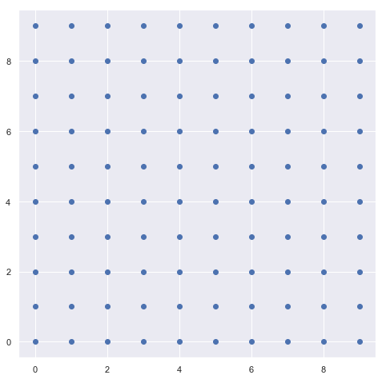
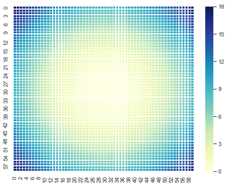
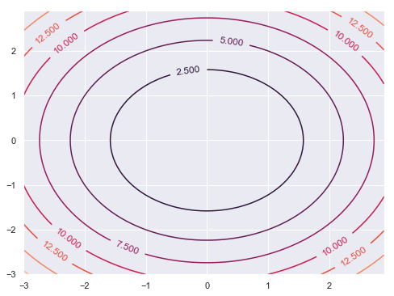
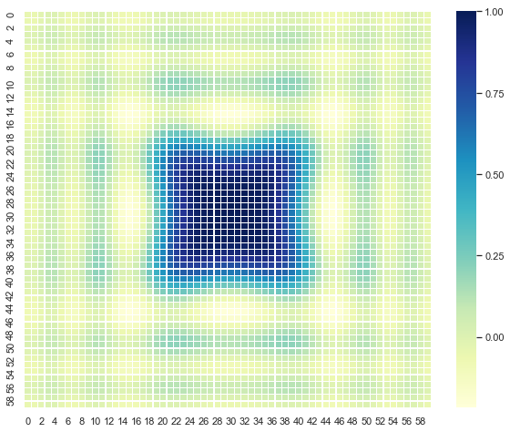
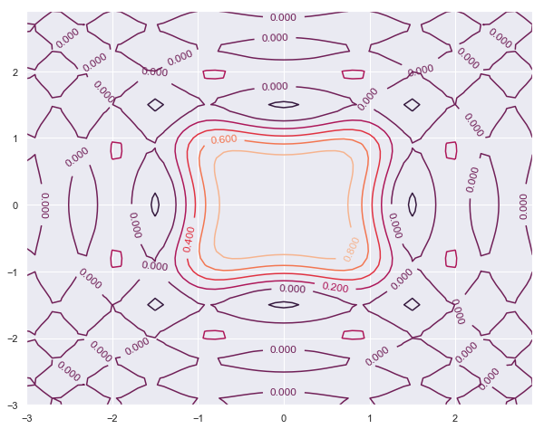
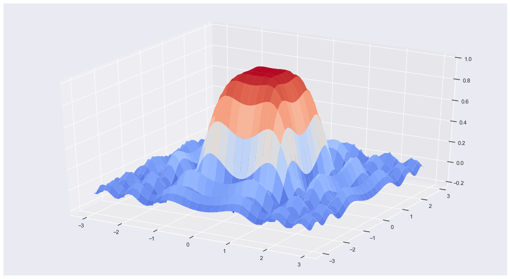

## Meshgrid : ```meshgrid```


```python
import numpy as np
import matplotlib.pyplot as plt
import seaborn as sns
sns.set()
```

How to create a grid and it's application to ploting cost functions:


```python
xs = np.arange(10)
ys = np.arange(10)

XG,YG = np.meshgrid(xs,ys)
```


```python
xs
```


    array([0, 1, 2, 3, 4, 5, 6, 7, 8, 9])


```python
ys
```


    array([0, 1, 2, 3, 4, 5, 6, 7, 8, 9])


```python
XG
```


    array([[0, 1, 2, 3, 4, 5, 6, 7, 8, 9],
           [0, 1, 2, 3, 4, 5, 6, 7, 8, 9],
           [0, 1, 2, 3, 4, 5, 6, 7, 8, 9],
           [0, 1, 2, 3, 4, 5, 6, 7, 8, 9],
           [0, 1, 2, 3, 4, 5, 6, 7, 8, 9],
           [0, 1, 2, 3, 4, 5, 6, 7, 8, 9],
           [0, 1, 2, 3, 4, 5, 6, 7, 8, 9],
           [0, 1, 2, 3, 4, 5, 6, 7, 8, 9],
           [0, 1, 2, 3, 4, 5, 6, 7, 8, 9],
           [0, 1, 2, 3, 4, 5, 6, 7, 8, 9]])


```python
YG
```


    array([[0, 0, 0, 0, 0, 0, 0, 0, 0, 0],
           [1, 1, 1, 1, 1, 1, 1, 1, 1, 1],
           [2, 2, 2, 2, 2, 2, 2, 2, 2, 2],
           [3, 3, 3, 3, 3, 3, 3, 3, 3, 3],
           [4, 4, 4, 4, 4, 4, 4, 4, 4, 4],
           [5, 5, 5, 5, 5, 5, 5, 5, 5, 5],
           [6, 6, 6, 6, 6, 6, 6, 6, 6, 6],
           [7, 7, 7, 7, 7, 7, 7, 7, 7, 7],
           [8, 8, 8, 8, 8, 8, 8, 8, 8, 8],
           [9, 9, 9, 9, 9, 9, 9, 9, 9, 9]])


```python
plt.figure(figsize = [8,8])
plt.scatter(XG,YG)
```


    <matplotlib.collections.PathCollection at 0x1bd1762eb00>





#### Example 1:  Simple Cost Function:

$$Z = x^2 + y^2$$


```python
ns = 10
xs = np.arange(-3,3,1/ns)
ys = np.arange(-3,3,1/ns)

XG,YG = np.meshgrid(xs, ys, sparse=True)  
```


```python
ZG = XG**2 + YG**2
```


```python
ZG
```


    array([[18.  , 17.41, 16.84, ..., 16.29, 16.84, 17.41],
           [17.41, 16.82, 16.25, ..., 15.7 , 16.25, 16.82],
           [16.84, 16.25, 15.68, ..., 15.13, 15.68, 16.25],
           ...,
           [16.29, 15.7 , 15.13, ..., 14.58, 15.13, 15.7 ],
           [16.84, 16.25, 15.68, ..., 15.13, 15.68, 16.25],
           [17.41, 16.82, 16.25, ..., 15.7 , 16.25, 16.82]])


```python
plt.figure(figsize = [8,6])
sns.heatmap(ZG, annot =False,cmap ="YlGnBu",linewidths=.2)
```


    <matplotlib.axes._subplots.AxesSubplot at 0x1bd161a9b70>





```python
plt.figure(figsize = [8,6])
CS = plt.contour(xs,ys,ZG)
plt.clabel(CS)
```


    <a list of 11 text.Text objects>





```python
from matplotlib import cm
from mpl_toolkits.mplot3d import Axes3D

fig = plt.figure(figsize = [8,6])
ax = fig.gca(projection='3d')

# Plot the surface.
surf = ax.plot_surface(XG, YG, ZG,\
                       cmap=cm.coolwarm,\
                       linewidth=0)


plt.show()
```


#### Example 2 : More Compex  Cost Function

$$\large{Z = \frac{sin(x^2+y^2).cos(x^2-y^2)}{x^2+y^2}}$$


```python
ns = 10
xs = np.arange(-3,3,1/ns)
ys = np.arange(-3,3,1/ns)

XG, YG = np.meshgrid(xs, ys, sparse=True)  
```


```python
ZG = np.sin(XG**2 + YG**2)*np.cos(XG**2 - YG**2) / (XG**2 + YG**2)
```

- 1. Heat Map


```python
plt.figure(figsize = [10,8])
sns.heatmap(ZG, annot =False,cmap ="YlGnBu",linewidths=.2)
```


    <matplotlib.axes._subplots.AxesSubplot at 0x1bd167c8cf8>





- 2. Contor Plot


```python
plt.figure(figsize = [10,8])
CS = plt.contour(xs,ys,ZG)
plt.clabel(CS)
```


    <a list of 36 text.Text objects>





-  3.  3D plot


```python
from matplotlib import cm
from mpl_toolkits.mplot3d import Axes3D
fig = plt.figure(figsize = [18,10])
ax = fig.gca(projection='3d')

# Plot the surface.
surf = ax.plot_surface(XG, YG, ZG,\
                       cmap=cm.coolwarm,\
                       linewidth=0)


plt.show()
```





